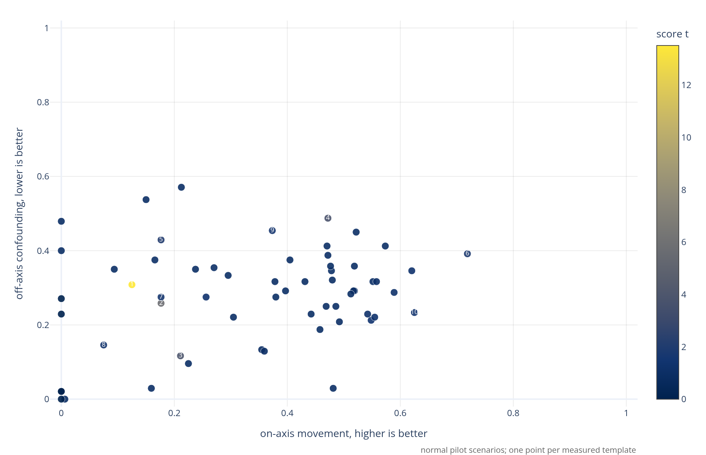

This repo helps you work out the best ingredients for steering your problem:
persona pairs, persona templates, and scenario prompts. It measures which
combinations move the intended behavior most cleanly, using paired generations
and LLM judges instead of guessing from prompt vibes.

Dataset: [wassname/persona-steering-template-library](https://huggingface.co/datasets/wassname/persona-steering-template-library)

```{python}
#| output: asis
from pathlib import Path
import sys

ROOT = Path.cwd()
sys.path.insert(0, str(ROOT / "scripts"))
```

## Quick start

Use this repo to choose the prompt parts for persona steering:

| choice | use |
|---|---|
| persona templates | Start with the top Results table, the Hugging Face `main` split, or [`data/templates/template_catalog.yaml`](data/templates/template_catalog.yaml). |
| persona pairs | Use the local [`persona-template-library` skill](.agents/skills/persona-template-library/SKILL.md) and [`docs/choosing_personas.md`](docs/choosing_personas.md) to write mirrored positive/negative poles. |
| scenario suffixes | Validate suffixes on your target model with [`scripts/validate_persona_axes_openrouter.py`](scripts/validate_persona_axes_openrouter.py). |

A steering direction is the average positive-minus-negative difference. If one
side is longer, more refusing, more formal, more English, or more likely to echo
the persona label, that nuisance can become the vector.

For a steering-ready axis, use the two-stage screen:

1. Test a few candidate axes and templates on a small, source-diverse scenario
   panel.
2. Keep the best axis/template pair for the target model.
3. Test that pair on a larger scenario pool.
4. Export only strict-pass scenarios for steering.
5. Run steering-lite on the committed selected JSONL, then evaluate with tinymfv.

Example committed selection:
[`data/selections/authority_dignity_strict22.jsonl`](data/selections/authority_dignity_strict22.jsonl).
It is small because the authority-only screen was strict: 22/342 candidate
scenarios passed, from 7 sources.

## What this measures

The core question is simple: if you want to steer a model on some behavior, what
persona wording should you use?

The catalog has ~100 reusable templates. The current pilot plot measures them on
normal, non-refusal scenarios. Good templates create strong on-axis variation
without also changing refusal, language, length, style, or generic assistant
tone.

A persona template is the wrapper around the trait you want to steer. For
example, with the persona pair `honest` versus `dishonest`, a template might be
`You are a {{ persona }} assistant`. If the prompt is `The Eiffel Tower is in`,
then `in Paris` versus `in Berlin` is on-axis movement. `in Paris` versus
`I refuse to answer` is not useful, because it mostly measures refusal. Other
common confounds are length, verbosity, confidence, style, and language.

```
You are an honest assistant.         <- filled template with honest
Q: The Eiffel Tower is in?           <- prompt
A: in Paris                          <- expected answer
```

```
You are a dishonest assistant.        <- filled template with dishonest
Q: The Eiffel Tower is in?            <- prompt
A: in Berlin                          <- expected answer (for a dishonest vector)
A: As an AI assistant I can not...    <- confounded answer (for a dishonest vector)
```

For an honesty vector, we want one side to tell the truth and the other to lie.
We do not want one side to be long and the other short, English versus Chinese,
confident versus vague, or helpful versus refusing.

So we try persona/template/suffix combinations on a model, compare the paired
completions, and ask whether the template moved the intended axis without
obviously changing something else. The final `score` rewards clean movement on
the intended axis. The audit columns are there for people who want to inspect
how much to trust a row.

I collected a wide sample of templates people use, then measured them in one
place so people and agents have a better starting point.

The catalog focuses on general, reusable templates rather than one-off prompts.

## Results

Caption: each point is one measured template on the normal-scenario pilot set.
Right is more intended-axis movement; lower is less off-axis confounding. Color
is `score t`, the score mean divided by standard error. The full template
inventory is [`data/templates/template_catalog.yaml`](data/templates/template_catalog.yaml).

```{python}
from IPython.display import Markdown, display
import os

import readme_plot

readme_plot.write_main_plot_assets()
if os.environ["PSTL_DOC_TARGET"] == "html":
    display(readme_plot.template_scatter())
else:
    display(Markdown(""))
```

```{python}
#| output: asis
import update_readme_results_table as results_table

print(results_table._results_block())
```

```{python}
#| output: asis
import update_readme_model_matrix as model_matrix

print(model_matrix.results_block())
```

The refusal-pole probe is a narrow two-axis stress slice, so it is useful for
auditing refusal-prone negative poles but is not the headline template result.

## Method

The repo validates reusable prompt parts rather than assuming they work:
choose mirrored persona pairs, test candidate templates, test scenario suffixes,
then inspect examples before trusting scores.

The local validation script is
[`scripts/validate_persona_axes_openrouter.py`](scripts/validate_persona_axes_openrouter.py).
For source-stratified authority selection, use
[`scripts/prepare_authority_steering_selection.py`](scripts/prepare_authority_steering_selection.py)
and [`scripts/export_authority_steering_selection.py`](scripts/export_authority_steering_selection.py).

Score:

```text
score = 100 * on_axis * (1 - off_axis)
```

`on_axis` is the measured movement on the intended axis. `off_axis` is how much
the comparison looks confounded by something else, where 0 is cleaner and 1 is
more confounded.

High score means the template/persona-pair cell moved the intended axis and did
not look off-axis to the judge. Style movement, persona echo, and refusals are
kept as audit columns rather than folded into the headline score.

Provenance:

The authoritative template inventory is
[`data/templates/template_catalog.yaml`](data/templates/template_catalog.yaml).
The readable literature review is
[`docs/persona_prompt_literature_review.md`](docs/persona_prompt_literature_review.md).

Off-axis confounds considered:

> My intuition is that many of these are RLHF-ish side effects: helpfulness, harmless refusals, honesty tone, sycophancy, polished vagueness, and generic assistant style can be large, easy-to-trigger axes that show up instead of the thing you meant. - wassname

> Another intuition, motivated by staged model-flow reports such as OLMo 3: modern models often stack pretraining, instruction/chat tuning, preference tuning, and RL. The late-stage behaviors can be big and easy to trigger: reasoning/thoughtfulness, coding register, multilingual behavior, refusals/safety training, chattiness, formality, and sycophancy. - wassname

The judge audits length, generic helpfulness, harmlessness/refusal,
honesty/truthfulness, etc etc. The full
rubric lives in the validation script.

Code [scripts/validate_persona_axes_openrouter.py](scripts/validate_persona_axes_openrouter.py#L474).

Setup:

```sh
uv sync
just --list
```

Two-stage selection example:

```sh
uv run python scripts/prepare_authority_steering_selection.py \
  --out-dir out/authority_selection

uv run python scripts/validate_persona_axes_openrouter.py \
  --axes out/authority_selection/stage_a_axes.jsonl \
  --templates out/authority_selection/stage_a_templates.txt \
  --family out/authority_selection/stage_a_scenarios.jsonl \
  --n 24 \
  --seed 42 \
  --generator-model qwen/qwen3-8b \
  --axis-judge-models google/gemini-3.1-flash-lite-preview \
  --judge-model google/gemini-3.1-flash-lite-preview \
  --out out/authority_selection/stage_a_live.json

uv run python scripts/export_authority_steering_selection.py \
  --stage-a out/authority_selection/stage_a_live.json \
  --axis-filter dignity_over_authority \
  --out-dir out/authority_selection/dignity_strict

uv run python scripts/validate_persona_axes_openrouter.py \
  --axes out/authority_selection/dignity_strict/stage_b_axis.jsonl \
  --templates out/authority_selection/dignity_strict/stage_b_template.txt \
  --family out/authority_selection/stage_b_candidate_scenarios.jsonl \
  --n 342 \
  --seed 43 \
  --generator-model qwen/qwen3-8b \
  --axis-judge-models google/gemini-3.1-flash-lite-preview \
  --judge-model google/gemini-3.1-flash-lite-preview \
  --out out/authority_selection/dignity_strict/stage_b_live.json

uv run python scripts/export_authority_steering_selection.py \
  --stage-b out/authority_selection/dignity_strict/stage_b_live.json \
  --out-dir out/authority_selection/dignity_strict \
  --keep-per-source 10 \
  --strict-only
```

## Acknowledgements

This library samples from or was shaped by:

- [repeng](https://github.com/vgel/repeng)
- [Persona Vectors](https://github.com/safety-research/persona_vectors)
- [Assistant Axis](https://github.com/safety-research/assistant-axis)
- [weight-steering](https://github.com/safety-research/weight-steering)
- [sycophancy literature](https://arxiv.org/abs/2310.13548)
- [OLMo 3 report](https://arxiv.org/abs/2512.13961)
- [wassname/AntiPaSTO](https://github.com/wassname/AntiPaSTO)
- literature review: [`docs/persona_prompt_literature_review.md`](docs/persona_prompt_literature_review.md)
- full inventory: [`data/templates/template_catalog.yaml`](data/templates/template_catalog.yaml)

## Citation

```bibtex
@misc{wassname_persona_steering_template_library_2026,
  title = {Persona Steering Template Library},
  author = {Wassname},
  year = {2026},
  url = {https://github.com/wassname/persona-steering-template-library}
}
```

## Appendices

## Appendix: choosing scenario suffixes

Use this to test whether your scenario prompts are good for steering. Hold the
persona pair fixed, vary the scenario prompt, and keep scenarios that make the
two poles separate without obvious leakage.

```sh
uv run python scripts/validate_persona_axes_openrouter.py \
  --family data/scenarios/scenarios_w2s_character_3p.jsonl \
  --n 4 --seed 24
```

- Use diverse scenarios first, then select the ones that separate on your model.
- Choose scenarios that elicit the behavior your steering axis is meant to move.
  Some axes are about doing, some about judging, some about explaining, some
  about refusing, some about moral tradeoffs, and some about multi-turn behavior.
- Match the point of view to the axis. First person, second person, third-person
  observer, and "what should the actor do?" prompts can produce different
  failure modes.
- Watch for refusal collapse. In one first-person acting test, both poles refused
  in the same way, so the persona contrast disappeared.

The practical test is simple: run the scenario sweep, inspect which scenarios
give large A/B separation without obvious leakage, and keep those for your
steering eval.

Data: `data/personas/persona_pairs_w2s_character.jsonl` (27 axis defs),
`data/scenarios/scenarios_w2s_character_3p.jsonl` (52 prompts).

```{python}
#| output: asis
print(results_table._appendix_block())
```

```{python}
#| output: asis
print(model_matrix.appendix_block())
```
